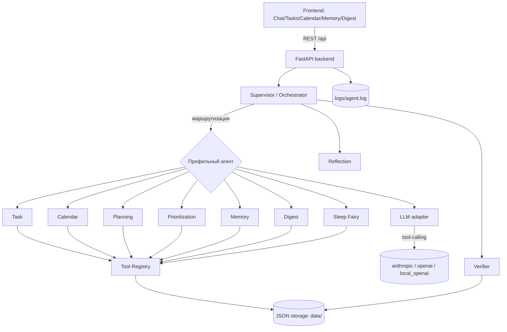

# ARCHITECTURE — архитектура системы

## Компоненты

1. **Frontend** (Vite + React + TS) — страницы Chat, Tasks, Calendar, Memory,
   Digest. В Docker раздаётся через nginx, который проксирует `/api` на backend.
2. **Backend API** (FastAPI) — REST-эндпоинты и точка входа в агентов.
3. **Agent Orchestrator (Supervisor)** — маршрутизация запроса профильному
   агенту, сборка итогового ответа, запуск Reflection и Verifier.
4. **Специализированные агенты** — Task, Calendar, Planning, Prioritization,
   Memory, Digest, Sleep Fairy.
5. **Reflection / Verifier** — детерминированные агенты самопроверки.
6. **Tool registry** — 39 инструментов с Pydantic-схемами входа.
7. **LLM-слой** — адаптер провайдера (`anthropic` / `openai` / `local_openai` /
   `none`) и универсальный agent loop с tool-calling.
8. **Storage** — локальные JSON-файлы (`data/`).
9. **Логи** — `logs/agent.log` (запрос, агент, tool calls, изменения,
   Reflection, Verifier, ошибки).

## Схема компонентов

## Жизненный цикл запроса `/chat`

1. `POST /chat` принимает `{message, history}`.
2. **Supervisor** определяет агента: при наличии LLM — классификацией
   (`classify`), иначе/при ошибке — keyword-роутером (`agents/router.py`).
3. Выбранный агент исполняется:
   - **LLM-режим:** `agent loop` — модель получает system-промпт агента и
     JSON-схемы его инструментов, делает tool-calls, реестр их валидирует и
     выполняет (меняя storage), результат возвращается модели; цикл повторяется
     до финального текста или лимита шагов.
   - **Rule-based режим:** детерминированные обработчики (`agents/fallback.py`)
     вызывают инструменты по правилам.
4. **Reflection** (`agents/reflection.py`) — проверяет полноту: выполнена ли
   цель, нет ли ошибок инструментов, конфликтов календаря, задач без дедлайна,
   нужно ли подтверждение, нет ли противоречий с памятью. Возвращает
   `ReflectionResult`.
5. **Verifier** (`agents/verifier.py`) — проверяет фактические изменения в
   storage (задача/событие/чеклист/дайджест/память реально созданы/обновлены).
   Возвращает `VerificationResult`.
6. Ответ собирается в `AgentMessage` (текст + routed_to + rationale + tool_calls
   + reflection + verification) и возвращается фронтенду, который их отображает.

Каждый шаг пишется в `logs/agent.log` структурированными событиями
(`user_request`, `routed`, `tool_call`, `tool_result`, `storage_change`,
`reflection`, `verification`, `tool_error`, `http_request`).

## Почему Reflection и Verifier детерминированы

Самопроверка должна быть надёжной и воспроизводимой. Поэтому Reflection и
Verifier реализованы как детерминированные анализаторы над списком выполненных
tool calls и текущим состоянием storage, а не как ещё один LLM-вызов. Это
гарантирует, что проверка результата не зависит от доступности модели и даёт
честный, проверяемый ответ «изменения действительно применены».

## Storage (локальные данные)

Каждая коллекция — отдельный JSON-файл в `data/` (атомарная запись через
временный файл, общий потоковый замок). Хранятся между перезапусками:

| Файл | Содержимое |
|------|------------|
| `data/tasks.json` | задачи |
| `data/checklists.json` | чеклисты и их пункты |
| `data/events.json` | события календаря |
| `data/memory.json` | личная память |
| `data/digests.json` | сохранённые дайджесты |
| `data/notes.json` | заметки базы знаний (опционально) |
| `data/knowledge_base/*.md` | markdown-заметки с YAML-фронтматтером |
| `logs/agent.log` | журнал событий |

В Docker `./data`, `./logs`, `./docs` смонтированы в backend-контейнер, поэтому
данные сохраняются на хосте и переживают `docker compose down/up`.

## Конфигурация

Все настройки — через переменные окружения / `.env` (`app/config.py`):
выбор LLM-провайдера, адрес/ключ/имя модели локального LLM, лимиты agent loop,
часовой пояс, CORS. Хардкода ключей, URL и имён моделей в коде нет.
