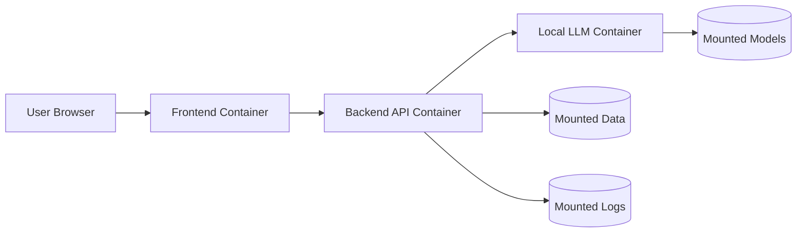

# DOCKER_ARCHITECTURE — контейнеры, порты, volume'ы

## Схема

## Назначение контейнеров

- **frontend** — статическая сборка React/Vite, раздаётся через **nginx**.
  nginx также проксирует запросы `/api/*` на backend (внутри compose-сети по
  имени `backend`), поэтому браузеру не нужен отдельный API-URL и нет проблем с CORS.
- **backend** — FastAPI: REST-API, оркестратор, агенты, инструменты, storage.
  Обращается к LLM по `http://llm:8000/v1`. Пишет данные в `/app/data` и логи в
  `/app/logs`.
- **llm** — локальный inference-сервер **llama.cpp** (OpenAI-совместимый API).
  Загружает GGUF-модель из `/models`. CPU по умолчанию, CUDA в GPU-режиме.

## Открытые порты (host → container)

| Сервис | Порт хоста | Порт контейнера | Назначение |
|--------|------------|-----------------|------------|
| frontend | `3000` (`FRONTEND_PORT`) | `80` | веб-интерфейс |
| backend | `8000` (`BACKEND_PORT`) | `8000` | REST API + Swagger |
| llm | `8001` (`LLM_PORT`) | `8000` | прямой доступ к LLM для отладки (`/v1/...`) |

Внутри compose-сети backend ходит к llm по `http://llm:8000` независимо от
проброса наружу.

## Volume'ы (монтирование с хоста)

| Хост | Контейнер | Сервис | Назначение |
|------|-----------|--------|------------|
| `./data` | `/app/data` | backend | задачи, чеклисты, события, память, дайджесты, база знаний |
| `./logs` | `/app/logs` | backend | `agent.log` |
| `./docs` | `/app/docs` | backend | документация (доступна контейнеру) |
| `./models` | `/models` | llm | GGUF-файл модели (только чтение модели) |

## Persistent vs ephemeral

- **Persistent (сохраняется на хосте, переживает `down/up`):**
  всё в `./data` (задачи, чеклисты, календарь, память, дайджесты, база знаний),
  логи в `./logs`, модель в `./models`.
- **Ephemeral (пересоздаётся):** сами контейнеры и их файловые системы, собранные
  образы frontend/backend, состояние процесса llama.cpp в памяти. Никаких важных
  данных внутри контейнеров не хранится.

## Healthchecks

- **backend:** `GET /health` (Python-проверка внутри контейнера).
- **llm:** `GET /health` сервера llama.cpp (через `curl`), с длинным
  `start_period` под загрузку модели.
- **frontend:** запрос корня nginx.

`backend` зависит от `llm` (`depends_on`), но стартует, не дожидаясь полной
загрузки модели (`condition: service_started`) — это держит API и UI доступными,
а текущий статус модели виден в `GET /health/llm`.

## Режимы запуска

- **CPU (по умолчанию):** `docker-compose.yml` → `make up`.
- **GPU (NVIDIA):** `docker-compose.yml` + `docker-compose.gpu.yml` →
  `make up-gpu` (CUDA-образ, проброс GPU, `LLM_GPU_LAYERS` из `.env`).
  Базовый файл не меняется, поэтому CPU-запуск всегда остаётся рабочим.
